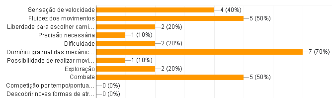
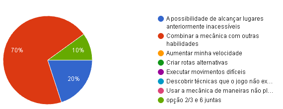
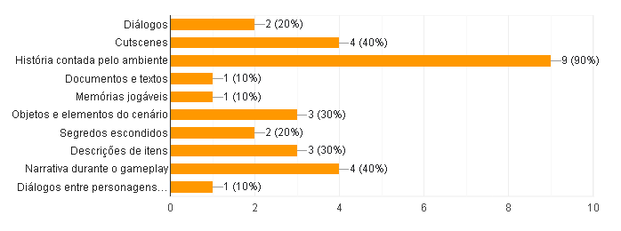
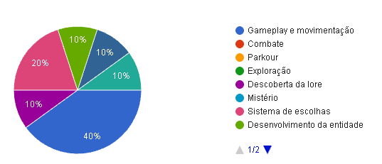

# OBLYSS
  
> **Two souls. One body. No identity of its own.**

---

## 🔍 Formularios
É comum de certa forma realizar pesquisas com publico-alvo pra conhecer mais sobre as pessoas que consomem o tipo de jogo que você esta querendo produzir, pensando nisso eu fiz um Formulario com algumas perguntas com relação a jogos de movimentação mais rápida e/ou combate mais intenso.
Depois de umas **10** respostas, eu resolvi juntar todas as respostas e sair marcando pontos interessantes que vão me ajudar bastante no desenvolvimento do projeto.
A seguir estão alguns resultados que eu acho extremamente importante comentar, pois o feedback obtido deles vai me ajudar bastante a saber que caminho tomar para tentar agradar o maximo o meu publico-alvo.

> Lembrando que obviamente, esses resultados não se aplicam a qualquer jogo do genero, deve ser levado em conta que os dados coletados nesse formulario, foram obtidos em grupos pequenos de pessoas, quanto mais respostas o seu formulario tiver, e quanto mais bem estruturado de certa forma ele for, melhor serão os dados que você vai obter com esse formulario, essa foi a MINHA experiencia com esse formulario.

### O que mais atrai você em jogos de movimentação rápida?
 
> A maioria dos participantes do Formulario, disseram que o **Domínio gradual das mecânicas** é a coisa que mais atrai eles em jogos de movimentação rápida, seguido de **Fluidez dos movimentos** e **Combate** empatados, e por fim **Sensação de velocidade**

### Em uma escala de 1 a 5, quanto você considera os seguintes elementos importantes em um jogo Fast-Paced?

### Quando você aprende uma mecânica de movimentação nova, o que mais desperta seu interesse? 
 
> A maioria dos participantes disseram que, o que mais despertava o interesse deles ao aprender uma mecânica nova, era **Combinar a mecânica com outras
habilidades**, isso diz basicamente que ao introduzir uma nova mecânica ao jogador, a maioria tende a querer misturar ela com outras mecânicas que a pessoa ja conhece, para ver se novos combos ou coisas parecidas podem surgir.

### Quais formas de apresentação narrativa mais despertam seu interesse? 
 
> Isso significa que a maioria dos participantes acha mais interessante quando a apresentação narrativa do jogo é feita atraves da **História contada pelo ambiente**, mas outra parte tambem gosta de que seja feita atraves de **Cutscenes** e da **Narrativa durante o gameplay**, de certo modo a maioria gosta de diversas formas como a apresentação narrativa é feita, é interessante focar nas 3 mais votadas visto que a maioria prefere mais elas.

### Depois de conhecer a proposta de OBLYSS, o que mais chamaria sua atenção para jogar o jogo?  
 
> Mesmo a maioria ficando mais interessada na **Gameplay e Movimentação** do jogo, não posso ignorar o fato de que diversas coisas diferentes atrairam a atenção das pessoas, tivemos pessoas interessadas no **Sistema de Escolhas**, outras no **Desenvolvimento da Entidade**, outras na **Descoberta de Lore** e outras na **Direção Artistica**, o que talvez signifique que esses deveriam ser os pontos PRINCIPAIS que eu deveria focar durante o desenvolvimento do jogo.